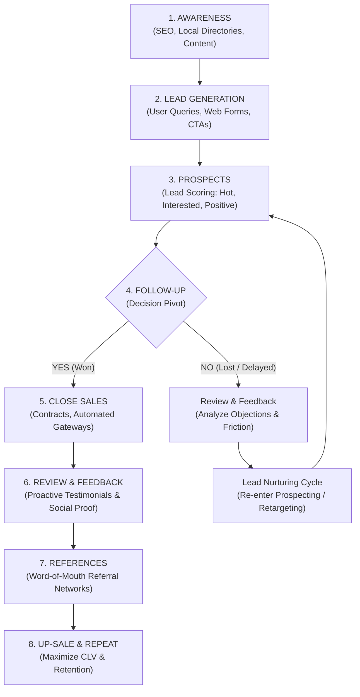

# Comprehensive Business Sales Funnel & Digital Asset Master Guide

**Document Metadata:**
- **Author/Publisher:** Sudarshan AI Labs
- **Publication Date:** 2 August 2026
- **Workspace Source:** `C:\Users\sheev\Downloads\SHEEVUM-2026\SALES-FUNNEL-DIAGRAM`
- **Scanned Assets:** 2 PDF Guides, 5 High-Resolution Diagram Images, 1 Interactive HTML Infographic, 1 System Version File.

---

## 1. Executive Summary & File Inventory Scan

This master document synthesizes the entire repository contents into a single, cohesive, actionable business guide and data blueprint. The repository provides an end-to-end framework for driving potential buyers from initial digital discovery (Awareness) to long-term brand advocates (Up-Sale & Repeat).

### Scanned Repository Files Matrix

| File Name | File Type | Size | Core Content & Function |
| :--- | :--- | :--- | :--- |
| [`Comprehensive Business Sales Funnel Guide-A4-size- (1).pdf`](file:///C:/Users/sheev/Downloads/SHEEVUM-2026/SALES-FUNNEL-DIAGRAM/Comprehensive%20Business%20Sales%20Funnel%20Guide-A4-size-%20(1).pdf) | PDF (4 Pages) | ~84.5 KB | Detailed 8-stage breakdown, strategies, lead classification, and conversion loops. |
| [`Comprehensive Business Sales Funnel- Long layoutr- Guide.pdf`](file:///C:/Users/sheev/Downloads/SHEEVUM-2026/SALES-FUNNEL-DIAGRAM/Comprehensive%20Business%20Sales%20Funnel-%20Long%20layoutr-%20Guide.pdf) | PDF (1 Page) | ~80.2 KB | Single-page continuous layout report combining strategic text & visual infographics. |
| [`business_funnel_infographic.html`](file:///C:/Users/sheev/Downloads/SHEEVUM-2026/SALES-FUNNEL-DIAGRAM/business_funnel_infographic.html) | HTML/JS | ~13.6 KB | Interactive Chart.js and Tailwind CSS web dashboard visualization. |
| [`core-funnel-architecture.png`](file:///C:/Users/sheev/Downloads/SHEEVUM-2026/SALES-FUNNEL-DIAGRAM/core-funnel-architecture.png) | PNG Image | ~79.0 KB | Visual funnel graphic depicting audience narrowing from Stage 1 to Stage 8. |
| [`follow-up-cycle.png`](file:///C:/Users/sheev/Downloads/SHEEVUM-2026/SALES-FUNNEL-DIAGRAM/follow-up-cycle.png) | PNG Image | ~109.0 KB | Dark-mode infographic focusing on the Follow-Up Pivot, Yes/No decision branches, and Revenue Velocity. |
| [`lead-segmentation.png`](file:///C:/Users/sheev/Downloads/SHEEVUM-2026/SALES-FUNNEL-DIAGRAM/lead-segmentation.png) | PNG Image | ~81.4 KB | Dashboard charts showing Lead Quality Donut and Stage Conversion Rates. |
| [`Comprehensive Business Sales Funnel Guide - visual selection 1.png`](file:///C:/Users/sheev/Downloads/SHEEVUM-2026/SALES-FUNNEL-DIAGRAM/IMAGES-Business%20Sales%20Funnel%20Guide%20-%20visual%20selection/Comprehensive%20Business%20Sales%20Funnel%20Guide%20-%20visual%20selection%201.png) | PNG Image | ~262.5 KB | Napkin-generated funnel diagram with icons and concise stage descriptions. |
| [`Comprehensive Business Sales Funnel Guide - visual selection 2.png`](file:///C:/Users/sheev/Downloads/SHEEVUM-2026/SALES-FUNNEL-DIAGRAM/IMAGES-Business%20Sales%20Funnel%20Guide%20-%20visual%20selection/Comprehensive%20Business%20Sales%20Funnel%20Guide%20-%20visual%20selection%202.png) | PNG Image | ~279.1 KB | Isometric 4-step diagram focusing on "Achieving Sales Success" in Awareness. |
| [`0.26.0`](file:///C:/Users/sheev/Downloads/SHEEVUM-2026/SALES-FUNNEL-DIAGRAM/0.26.0) | System File | 0 Bytes | Version marker tag file. |

---

## 2. Core Funnel Architecture (The 8 Stages)

The sales funnel serves as a systematic filtration and relationship-building machine. Below is the comprehensive breakdown of each stage:

---

### Stage Breakdown & Execution Playbook

### Stage 1: Awareness
- **Objective:** Maximize market reach and digital visibility.
- **Key Strategies:**
  1. **SEO Optimization:** Enhance website domain authority and target high-intent keywords to secure organic search rankings.
  2. **Local & Industry Directories:** Maintain updated profiles on Google Business Profile, LinkedIn, and sector-specific databases.
  3. **Engaging Content Strategy:** Publish blogs, whitepapers, and videos that solve buyer pain points.
- **Primary Goal:** Establish an authoritative digital footprint so potential customers discover your brand naturally.

### Stage 2: Lead Generation
- **Objective:** Convert passive awareness viewers into active leads.
- **Key Strategies:**
  1. **User Queries Response:** Provide rapid response times across email, web forms, and social media DMs.
  2. **Strategic Touchpoints & CTAs:** Simplify contact paths with unambiguous Calls to Action on landing pages.
  3. **Lead Magnets & Interactive Tools:** Deploy chatbots, downloadable eBooks, and calculators in exchange for contact information.
- **Primary Goal:** Capture verified contact details and initiate conversation.

### Stage 3: Prospects & Lead Qualification
- **Objective:** Qualify, score, and segment incoming audience.
- **Lead Quality Matrix:**
  - **Hot Leads (25% mix):** High-intent buyers seeking an immediate solution. *SLA requirement: Response in under 5 minutes.*
  - **Interested Leads (45% mix):** Engaged users evaluating options who require structured demo/pitch.
  - **Positive Leads (30% mix):** Casual/warm browsers who need further education and content nurturing.
- **Primary Goal:** Prioritize high-value prospects for personalized sales team outreach.

### Stage 4: The Follow-Up Pivot (Critical Decision Point)
- **Objective:** Build deep trust, demonstrate ROI, and eliminate purchase friction.
- **Core Pillars:**
  1. **Relationship Management:** Focus on consultative problem-solving rather than hard-selling.
  2. **Custom Proposals & Quotes:** Deliver transparent, professional documentation tailored to prospect requirements.
  3. **Sentiment Analysis:** Monitor verbal and non-verbal cues. Immediately identify and mitigate friction points (price, trust, timing).
- **Primary Goal:** Guide the prospect to a definitive "YES" decision.

---

## 3. Decision & Conversion Loop Architecture

When a prospect reaches the Stage 4 Follow-Up decision milestone, the workflow splits into two distinct loops:

### The "YES" Path (Won Deal Execution)
1. **Close Sales (Stage 5):** Finalize contracts and process transactions using friction-free automated payment gateways.
2. **Review & Feedback (Stage 6):** Immediately post-onboarding, request customer reviews and ratings to generate social proof.
3. **References (Stage 7):** Launch structured referral incentives to turn satisfied buyers into brand advocates.
4. **Up-Sale & Repeat (Stage 8):** Cross-sell complementary products, upsell premium tiers, and lock in recurring retention.

### The "NO" Path (Objection Analysis & Retargeting)
1. **Root Cause Analysis (Review & Feedback):** Conduct exit surveys and sentiment audits to identify why the deal stalled (e.g., price objection, feature gap, competitor choice).
2. **Nurturing Re-entry:** Re-assign the lead into secondary drip sequences, educational content loops, or delayed follow-up reminders (60-90 day re-engagement).

---

## 4. Key Performance Metrics & Benchmarks

Based on the scanned visual analytics data:

| Funnel Transition | Conversion Benchmark | Optimization Insight |
| :--- | :--- | :--- |
| **Awareness -> Lead Generation** | 12% | Boosted by high-intent CTA copy and SEO landing page optimization. |
| **Lead Generation -> Prospect** | 28% | Achieved through automated lead scoring and instant contact response. |
| **Prospect -> Close Sales** | 15% | Direct beneficiary of prompt follow-up and tailored price quotes. |
| **Close Sales -> Repeat/Upsell** | 40% | High retention yield driven by robust review and reference loops. |

> **Key Takeaway:** A modest **5% improvement** in Follow-Up conversion yields up to a **20% compound increase** in final Close Sales due to funnel momentum.

---

## 5. Visual Asset Catalog & Image References

The workspace contains 5 graphic assets representing different perspectives of the funnel architecture:

1. **[`core-funnel-architecture.png`](file:///C:/Users/sheev/Downloads/SHEEVUM-2026/SALES-FUNNEL-DIAGRAM/core-funnel-architecture.png):** Trapezoidal visual stack of all 8 stages from Awareness (Blue) down to Up-Sale & Repeat (Purple).
2. **[`follow-up-cycle.png`](file:///C:/Users/sheev/Downloads/SHEEVUM-2026/SALES-FUNNEL-DIAGRAM/follow-up-cycle.png):** Dark-mode dashboard featuring the Yes/No Follow-up Pivot, Revenue Velocity chart, and post-sale retention tiles.
3. **[`lead-segmentation.png`](file:///C:/Users/sheev/Downloads/SHEEVUM-2026/SALES-FUNNEL-DIAGRAM/lead-segmentation.png):** Dual dashboard featuring the Lead Quality Doughnut Chart and Stage Conversion Rate Bar Chart.
4. **[`Comprehensive Business Sales Funnel Guide - visual selection 1.png`](file:///C:/Users/sheev/Downloads/SHEEVUM-2026/SALES-FUNNEL-DIAGRAM/IMAGES-Business%20Sales%20Funnel%20Guide%20-%20visual%20selection/Comprehensive%20Business%20Sales%20Funnel%20Guide%20-%20visual%20selection%201.png):** Modern dark theme graphic showcasing icons and stage descriptions.
5. **[`Comprehensive Business Sales Funnel Guide - visual selection 2.png`](file:///C:/Users/sheev/Downloads/SHEEVUM-2026/SALES-FUNNEL-DIAGRAM/IMAGES-Business%20Sales%20Funnel%20Guide%20-%20visual%20selection/Comprehensive%20Business%20Sales%20Funnel%20Guide%20-%20visual%20selection%202.png):** Isometric 3D staircase diagram illustrating the 4 pillars of Awareness & Discovery.

---
*Created by Antigravity for Sudarshan AI Labs Sales Funnel Knowledge System.*
